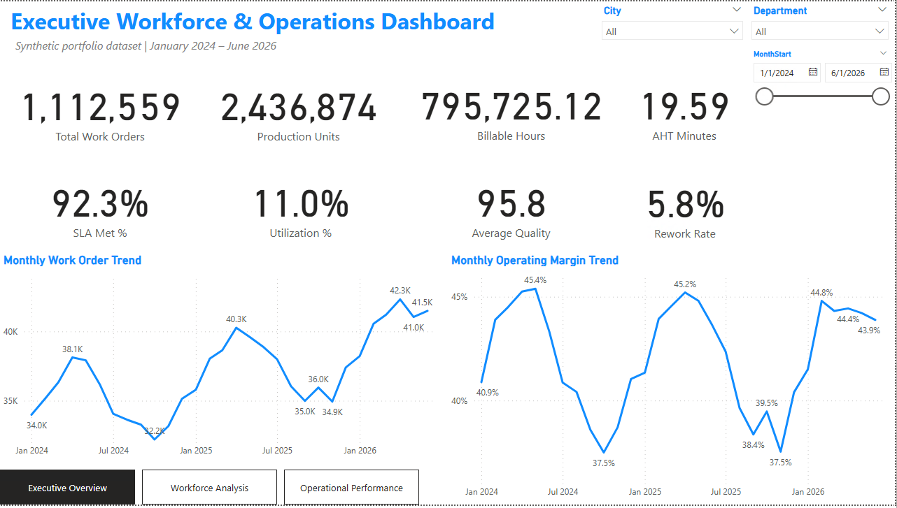
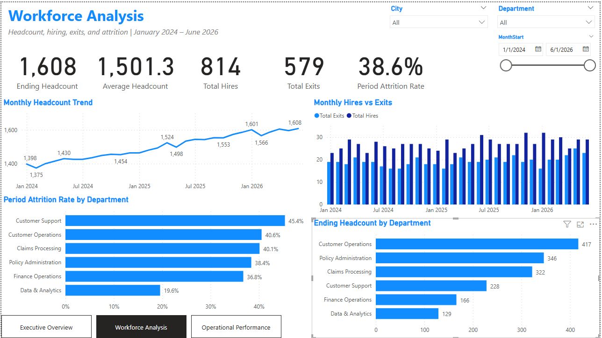
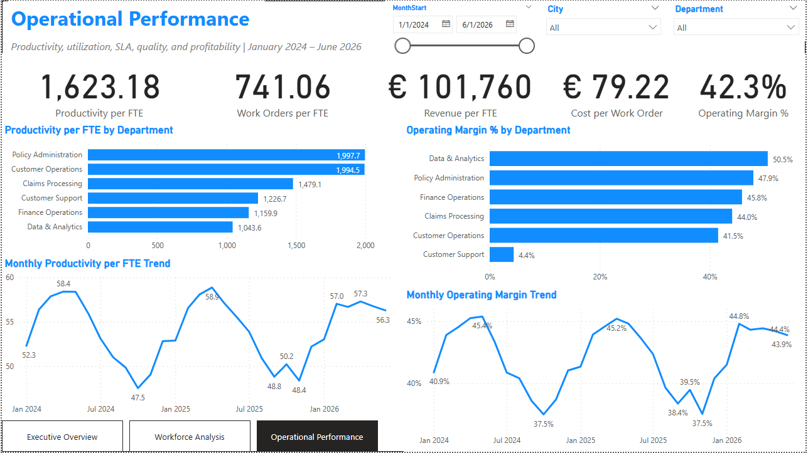

# Executive Workforce & Operations Dashboard

A multi-page Power BI portfolio project analyzing workforce trends, operational productivity, service quality, and profitability using a synthetic dataset.

> **Data privacy:** All data is synthetic and created solely for portfolio demonstration. No employer, client, employee, credential, or production-system data is included.

## Dashboard Preview

### Executive Overview



### Workforce Analysis



### Operational Performance



[Download the Power BI report (.pbix)](dashboard/Executive_Workforce_Operations_Dashboard.pbix)

## Business Objective

This project provides management with a consolidated view of:

- Workforce growth, hiring, exits, and attrition
- Operational workload and production
- Productivity and work orders per FTE
- SLA attainment, utilization, quality, and rework
- Revenue, cost efficiency, and operating margin
- Department, city, and monthly performance trends

## Dashboard Pages

### 1. Executive Overview

Provides a high-level summary of operational performance, including:

- Total work orders
- Production units
- Billable hours
- Average Handle Time (AHT)
- SLA attainment
- Utilization
- Average quality
- Rework rate
- Monthly workload and operating-margin trends

### 2. Workforce Analysis

Examines workforce movement and departmental staffing:

- Ending and average headcount
- Total hires and exits
- Period attrition rate
- Monthly headcount trend
- Monthly hires versus exits
- Attrition rate by department
- Ending headcount by department

### 3. Operational Performance

Evaluates productivity, efficiency, and profitability:

- Production units per FTE
- Work orders per FTE
- Revenue per FTE
- Cost per work order
- Operating margin
- Department-level productivity and profitability
- Monthly productivity and margin trends

## Data Model

The Power BI report uses a star-schema model:

- `FactOperations` — monthly workforce and operational measures
- `DimDate` — calendar and fiscal reporting attributes
- `DimDepartment` — department, division, cost centre, and targets
- `DimLocation` — city, country, region, and currency

Relationships use one-to-many cardinality with single-direction filtering from the dimension tables to the fact table.

## Tools and Skills Demonstrated

- Power BI Desktop
- Power Query
- DAX measures
- Star-schema data modelling
- KPI design and validation
- Interactive slicers and page navigation
- Workforce analytics
- Operational and profitability analysis
- Business-focused data visualization
- GitHub documentation

## Repository Structure

```text
executive-workforce-operations-dashboard/
├── dashboard/
│   ├── Executive_Workforce_Operations_Dashboard.pbix
│   ├── Executive_overview.png
│   ├── Workforce_analysis.png
│   └── Operational_performance.png
├── LICENSE
└── README.md
